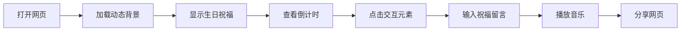

## 1. Product Overview
为一位27岁的酷女孩打造的生日祝福网页，采用工业暗黑风格设计，具有可交互的电子贺卡体验。

- **核心目的**: 提供独特、酷炫的生日祝福体验，展示用心和品味
- **目标用户**: 27岁的女性朋友，喜欢酷炫、工业风设计
- **市场价值**: 超越传统纸质贺卡，提供数字化、可分享的个性化祝福

## 2. Core Features

### 2.1 Feature Module
1. **生日祝福主页**: 动态视觉效果、生日倒计时、交互式元素
2. **祝福留言区**: 可添加祝福留言的互动区域
3. **音乐播放器**: 可播放生日背景音乐

### 2.2 Page Details
| Page Name | Module Name | Feature description |
|-----------|-------------|---------------------|
| 生日祝福主页 | Hero Section | 动态背景、霓虹效果、年龄数字展示、生日日期 |
| 生日祝福主页 | 倒计时模块 | 实时显示距离生日的时间 |
| 生日祝福主页 | 交互元素 | 点击触发的动画效果、粒子效果 |
| 生日祝福主页 | 祝福留言 | 用户可输入并显示祝福文字 |
| 生日祝福主页 | 音乐控制 | 背景音乐播放/暂停控制 |

## 3. Core Process
用户打开网页 → 欣赏动态视觉效果 → 查看倒计时 → 阅读祝福内容 → 点击交互元素 → 输入个人祝福 → 播放背景音乐 → 分享网页

## 4. User Interface Design

### 4.1 Design Style
- **主色调**: 深蓝黑(#0a0e17)、炭灰色(#1a1f2e)、冷蓝色(#2a5c8a)、银灰色(#8892a8)
- **强调色**: 霓虹蓝(#00d4ff)、紫色(#9d4edd)
- **文字颜色**: 白色(#ffffff)、浅灰(#e0e6ed)
- **按钮风格**: 圆角矩形，冷蓝色或深灰色背景，简洁文字
- **字体**: 现代无衬线字体，标题使用粗体
- **布局风格**: 卡片式分组、网格布局、严格对齐
- **图标风格**: 线性、扁平化工业风图标

### 4.2 Page Design Overview
| Page Name | Module Name | UI Elements |
|-----------|-------------|-------------|
| 生日祝福主页 | Hero Section | 深色渐变背景、霓虹边框效果、动态粒子、大字体标题 |
| 生日祝福主页 | 倒计时模块 | 卡片式布局、数字动画、科技感设计 |
| 生日祝福主页 | 祝福内容 | 居中排版、优雅字体、渐入动画 |
| 生日祝福主页 | 交互元素 | 悬停效果、点击动画、霓虹光晕 |
| 生日祝福主页 | 音乐控制 | 极简播放器、浮动按钮 |

### 4.3 Responsiveness
- 桌面优先设计
- 移动端自适应布局
- 触控优化交互

### 4.4 Animation Effects
- 页面加载时的渐入动画
- 粒子浮动效果
- 鼠标跟随光效
- 数字滚动动画
- 按钮悬停缩放效果
