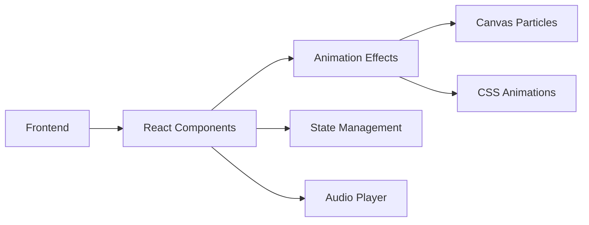

## 1. Architecture Design


## 2. Technology Description
- **Frontend**: React@18 + TypeScript + TailwindCSS@3 + Vite
- **Initialization Tool**: vite-init
- **Backend**: None (纯前端项目)
- **Animation**: Canvas API + CSS Animations
- **Icons**: lucide-react

## 3. Route Definitions
| Route | Purpose |
|-------|---------|
| / | 生日祝福主页 |

## 4. Component Structure
```
src/
├── components/
│   ├── HeroSection.tsx      # 主视觉区域
│   ├── Countdown.tsx        # 倒计时组件
│   ├── WishMessage.tsx      # 祝福信息组件
│   ├── InteractiveCard.tsx  # 交互卡片组件
│   ├── MusicPlayer.tsx      # 音乐播放器
│   └── ParticleBackground.tsx # 粒子背景
├── hooks/
│   └── useCountdown.ts      # 倒计时逻辑
├── utils/
│   └── constants.ts         # 常量定义
├── App.tsx
├── main.tsx
└── index.css
```

## 5. State Management
使用React useState管理：
- 倒计时状态
- 音乐播放状态
- 用户输入的祝福内容
- 交互动画状态

## 6. Data Model
无需数据库，纯前端项目。

### 6.1 静态数据
- 生日日期: 配置在常量文件中
- 预设祝福内容: 存储在组件中

## 7. Performance Considerations
- 使用requestAnimationFrame优化粒子动画
- 懒加载非关键资源
- CSS动画使用GPU加速
- 响应式设计适配不同设备
